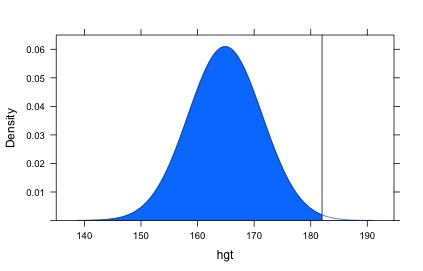

In this lab we'll investigate the probability distribution that is most central
to statistics: the normal distribution.  If we are confident that our data are 
nearly normal, that opens the door to many powerful statistical methods.  Here 
we'll use the graphical tools of R to assess the normality of our data and also 
learn how to generate random numbers from a normal distribution.

## The Data

This week we'll be working with measurements of body dimensions.  This data set 
contains measurements from 247 men and 260 women, most of whom were considered 
healthy young adults.

```{r, echo=FALSE}
library(knitr)
opts_chunk$set(eval = FALSE)
```

```{r load-data, eval=TRUE, message=FALSE}
require(mosaic)
require(oilabs)
require(dplyr)
data(bdims)
```

Let's take a quick peek at the first few rows of the data.

```{r head-data}
head(bdims)
```

You'll see that for every observation we have 25 measurements, many of which are
either diameters or girths.  A key to the variable names can be found by typing `?bdims`,
but we'll be focusing on just three columns to get started: weight in kg (`wgt`), 
height in cm (`hgt`), and `sex` (`m` indicates male, `f` indicates female).

Since males and females tend to have different body dimensions, it will be 
useful to create two additional data sets: one with only men and another with 
only women.

```{r male-female, eval=TRUE}
mdims <- filter(bdims, sex == "m")
fdims <- filter(bdims, sex == "f")
```

1.  Make a plot (or plots) to compare the distributions of men's and women's heights.  How 
    would you compare the various aspects of the two distributions?

## The normal distribution

In your description of the distributions, did you use words like *bell-shaped* 
or *normal*?  It's tempting to say so when faced with a unimodal symmetric 
distribution.

To see how accurate that description is, we can plot a normal distribution curve 
on top of a histogram to see how closely the data follow a normal distribution. 
This normal curve should have the same mean and standard deviation as the data. 
We'll be working with women's heights, so let's store them as a separate object 
and then calculate some statistics that will be referenced later. 

```{r female-hgt-mean-sd, eval=TRUE}
meanFheight <- mean(~hgt, data = fdims)
sdFheight <- sd(~hgt, data = fdims)
```

Next we want to make a density histogram to use as the backdrop and use the `fit` argument to overlay a normal probability curve. The `histogram()` command has a parameter called `type` that allows us to specify if we want to see `count`, `percent` or `density` in our histogram. Setting `type="count"` produces a frequency histogram, which shows the number of data points that fall into a particular bin. In a frequency histogram, the *heights* of the bars add up to the total number of observations. 

```{r mosaic-hist1}
histogram(~hgt, data = mdims, type="count")
```

Setting `type="percent"` changes the labels to percentages of the data that fall into each bin. Now, the *heights* of the bars all add up to 1. 

```{r mosaic-hist2}
histogram(~hgt, data=mdims, type="percent")
```

Finally, `type="density"` creates a density histogram. In a density histogram the *areas* of the bars add up to 1. The area of each bar can be calculated as simply the height *times* the width of the bar.

```{r mosaic-hist3}
histogram(~hgt, data = mdims, type = "density")
```

Frequency, percent, and density histograms all display the same shape; they only differ in their $y$-axis. You can verify this by comparing the three histograms we just constructed.

Using a density histogram allows us to properly overlay a normal distribution curve over the histogram since the curve is a normal probability density function. R is helpful and won't allow you to run this command with any type other than `density`. 
````{r hist-height, message=FALSE}
histogram(~hgt, data = fdims, fit = "normal", nint = 8, type = "density")
```

Notice that adding the `fit` argument to `histogram` overlays a normal distribution on plot. The optional `nint` argument simply specificies the number of bins.


2.  Based on the this plot, does it appear that the data follow a nearly normal 
    distribution?


## Evaluating the normal distribution

Eyeballing the shape of the histogram is one way to determine if the data appear
to be nearly normally distributed, but it can be frustrating to decide just how 
close the histogram is to the curve. An alternative approach involves 
constructing a normal probability plot, also called a normal Q-Q plot for 
"quantile-quantile".

````{r qq}
qqmath(~hgt, data = fdims, type = c("p", "r"))
```

In this command, the `p` signifies points and the `r` says to add a regression line. 

A data set that is nearly normal will result in a probability plot where the 
points closely follow a line.  Any deviations from normality leads to 
deviations of these points from the line.  The plot for female heights shows 
points that tend to follow the line but with some errant points towards the 
tails.  We're left with the same problem that we encountered with the histogram 
above: how close is close enough?

A useful way to address this question is to rephrase it as: what do probability 
plots look like for data that I *know* came from a normal distribution?  We can 
answer this by simulating data from a normal distribution using `rnorm`.

````{r sim-norm}
sim_norm <- rnorm(n = nrow(fdims), mean = meanFheight, sd = sdFheight)
```

The first argument indicates how many numbers you'd like to generate, which we specify to be the same number of heights in the `fdims` data set using the `nrow` function.  The last two arguments determine the mean and standard deviation of the normal distribution from which the simulated sample will be generated.  We can take a look at the shape of our simulated data set, `sim_norm`, as well as its normal probability plot.

3.  Make a normal probability plot of `sim_norm`.  Do all of the points fall on 
    the line?  How does this plot compare to the probability plot for the real 
    data?

Even better than comparing the original plot to a single plot generated from a 
normal distribution is to compare it to many more plots using the following 
function. It may be helpful to click the zoom button in the plot window.

```{r qqnormsim, message=FALSE}
qqnormsim(hgt, data = fdims)
```

4.  Does the normal probability plot for `hgt` look similar to the plots 
    created for the simulated data?  That is, do plots provide evidence that the
    female heights are nearly normal?

5.  Using the same technique, determine whether or not female weights appear to 
    come from a normal distribution.

## Normal probabilities

Okay, so now you have a slew of tools to judge whether or not a variable is 
normally distributed.  Why should we care?

It turns out that statisticians know a lot about the normal distribution.  Once 
we decide that a random variable is approximately normal, we can answer all 
sorts of questions about that variable related to probability.  Take, for 
example, the question of, "What is the probability that a randomly chosen young 
adult female is taller than 6 feet (about 182 cm)?" (The study that published
this data set is clear to point out that the sample was not random and therefore 
inference to a general population is not suggested.  We do so here only as an
exercise.)

If we assume that female heights are normally distributed (a very close 
approximation is also okay), we can find this probability by calculating a Z 
score and consulting a Z table (also called a normal probability table).  In R, 
this is done in one step with the function `pnorm`.

```{r pnorm}
1 - pnorm(q = 182, mean = meanFheight, sd = sdFheight)
```


Note that the function `pnorm` gives the area under the normal curve below a 
given value, `q`, with a given mean and standard deviation.  



=======
Since we're interested in the probability that someone is taller than 182 cm, we have to 
take one minus that probability.

Assuming a normal distribution has allowed us to calculate a theoretical 
probability.  If we want to calculate the probability empirically, we simply 
need to determine how many observations fall above 182 then divide this number 
by the total sample size.

```{r probability}
sum(~ hgt > 182, data = fdims) / nrow(fdims)
```

Although the probabilities are not exactly the same, they are reasonably close. 
The closer that your distribution is to being normal, the more accurate the 
theoretical probabilities will be.

6.  Write out two probability questions that you would like to answer; one 
    regarding female heights and one regarding female weights.  Calculate the 
    those probabilities using both the theoretical normal distribution as well 
    as the empirical distribution (four probabilities in all).  Which variable,
    height or weight, had a closer agreement between the two methods?

* * *

## On Your Own

-   Now let's consider some of the other variables in the body dimensions data 
    set.  Using the figures at the end of the exercises, match the histogram to 
    its normal probability plot.  All of the variables have been standardized 
    (first subtract the mean, then divide by the standard deviation), so the 
    units won't be of any help.  If you are uncertain based on these figures, 
    generate the plots in R to check.

    **a.** The histogram for female biiliac (pelvic) diameter (`bii.di`) belongs
    to normal probability plot letter ____.

    **b.** The histogram for female elbow diameter (`elb.di`) belongs to normal 
    probability plot letter ____.

    **c.** The histogram for general age (`age`) belongs to normal probability 
    plot letter ____.

    **d.** The histogram for female chest depth (`che.de`) belongs to normal 
    probability plot letter ____.

-   Note that normal probability plots C and D have a slight stepwise pattern.  
    Why do you think this is the case?

-   As you can see, normal probability plots can be used both to assess 
    normality and visualize skewness.  Make a normal probability plot for female 
    knee diameter (`kne.di`).  Based on this normal probability plot, is this 
    variable left skewed, symmetric, or right skewed?  Use a histogram to confirm 
    your findings.


<div id="license">
This is a product of OpenIntro that is released under a 
[Creative Commons Attribution-ShareAlike 3.0 Unported](http://creativecommons.org/licenses/by-sa/3.0). 
This lab was adapted for OpenIntro by Andrew Bray and Mine &Ccedil;etinkaya-Rundel
from a lab written by Mark Hansen of UCLA Statistics.
</div>
